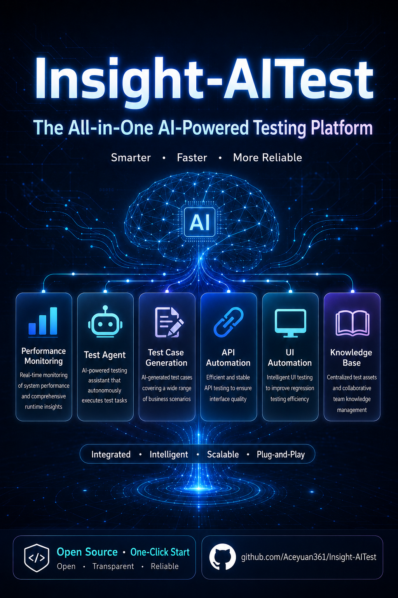
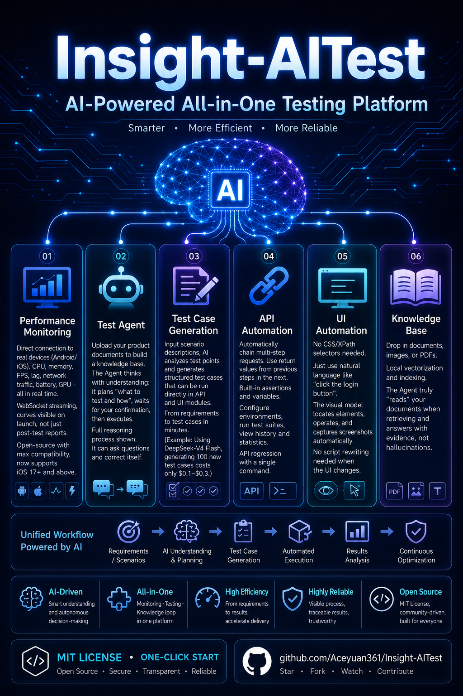

# Insight-AITest

<div align="center">

**Modular AI-Powered Testing & Monitoring Platform**

[](https://opensource.org/licenses/LICENSE)
[](https://www.python.org/downloads/)
[](https://react.dev/)
[](https://www.typescriptlang.org/)
[](https://github.com/Aceyuan361/Insight-AITest/releases)
[](#testing)

**[中文文档](./README.zh-CN.md)** | English

</div>

<p align="center">
  
</p>

---

## Introduction

Insight-AITest is a **modular AI-powered testing & monitoring platform**. v2.0.0 evolves it from a single performance tool into a plugin-based platform where every capability ships as a module driven by a `manifest.yaml`. The platform kernel (`platform/`) assembles the app by scanning modules and registering routes; a React shell frontend (`shell-frontend/`) renders each module's UI from the same manifest.

> **v2.1.0 — iOS 26 full support & real FPS:**
> - iOS 17+/26 device connection via pymobiledevice3 v10.x userspace tunnel (no root/admin)
> - Auto-mount Personalized DDI + reveal Developer Mode toggle without Xcode
> - Real app FPS via DVT Graphics service (CoreAnimation frame rate) + Jank detection
> - CPU usage normalized by core count (PerfDog/Xcode standard)
> - App list classification for iOS 26's degraded `ApplicationType`
> - Network collector graceful degradation (pcapd unsupported on iOS 17+/26 RSD)

> **v2.0.0 ships six core modules (A–F) plus a knowledge-base module, all complete:**
>
> | # | Module | Route | Purpose |
> |---|--------|-------|---------|
> | A | **Platform Shell** | — | Kernel + module system + shared frontend shell |
> | B | **Performance** | `/performance` | Real-time mobile device performance monitoring (Android/iOS) |
> | C | **AI Assistant** | `/ai` | RAG chat over a local knowledge base |
> | D | **Test Case Generation** | `/testcase` | AI-driven test case generation (analyze → select → generate → review) |
> | E | **API Automation** | `/api-runner` | Execute API test cases (multi-step + assertions + variable chaining) |
> | F | **UI Automation** | `/ui-runner` | Midscene vision-driven browser automation |
> | — | **Knowledge Base** | `/kb` | Project knowledge base (document upload, RAG indexing for C/D) |

### Key Features

- **Pluggable modules**: every capability is a self-contained module — add one with a `manifest.yaml`.
- **Performance monitoring**: real-time CPU / memory / FPS / network / battery for Android and iOS (see metrics table) over WebSocket.
- **AI assistant**: chat grounded in your own documents (local embeddings + vector store, RAG).
- **Test-case generation**: AI analyzes scenarios and proposes structured test cases for review.
- **API automation**: multi-step HTTP cases with assertions, variable chaining (`{{var}}`), and history.
- **UI automation**: Midscene (vision LLM) drives a real browser — `aiAction` / `aiAssert` / `aiQuery` — with per-step screenshots.

### Why Insight-AITest?

Most testing tools solve **one** problem well. Insight-AITest is the only open-source platform that fuses **performance monitoring, AI agents, test generation, and API/UI automation into one cohesive product** — so your data, cases, and results live in one place instead of being scattered across Postman + JMeter + Selenium + a wiki.

| Capability | Insight-AITest | Postman | MeterSphere | Katalon | Selenium/Playwright |
|---|:---:|:---:|:---:|:---:|:---:|
| 🤖 AI Agent (understands docs, plans, executes) | ✅ | ❌ | ❌ | ⚠️ Limited | ❌ |
| 📊 Mobile performance monitoring (Android/iOS) | ✅ | ❌ | ❌ | ❌ | ❌ |
| 📝 AI test-case generation | ✅ | ❌ | ❌ | ⚠️ Limited | ❌ |
| 🔗 API automation (steps + assertions + suites) | ✅ | ✅ | ✅ | ✅ | ❌ |
| 🖥️ Vision-driven UI automation (no selectors) | ✅ | ❌ | ❌ | ❌ | ⚠️ Code only |
| 📚 Local RAG knowledge base (your docs) | ✅ | ❌ | ❌ | ❌ | ❌ |
| 🔒 Data stays local (no cloud lock-in) | ✅ | ❌ | ⚠️ | ❌ | ✅ |
| 🧩 Plugin module architecture | ✅ | — | ⚠️ | ❌ | — |
| 💰 Cost | 🟢 Free / MIT | 🟡 Freemium | 🟢 Free | 🔴 Paid | 🟢 Free |

### 💎 Core Advantages

| Traditional way | Insight-AITest | Why it matters |
|---|---|---|
| Write API/UI scripts by hand | Describe what to test in natural language; the Agent plans & executes | Hours → minutes; survives UI/API changes without rewriting scripts |
| Performance = separate tool, post-hoc reports | Real-time WebSocket stream, the moment you hit start | Catch regressions live, not after the run |
| Knowledge scattered in wikis/docs | Upload docs → local vector index → Agent answers grounded in *your* product | The AI actually "reads" your docs; answers are traceable, not hallucinated |
| Pick selector / XPath by hand | Vision LLM finds the element from a screenshot + description | No more broken tests when the page re-renders |
| Switch between 4–5 tools | One platform, one data model, plugin-extensible | Cases flow: generated → run as API → run as UI, all in one place |

### Supported Performance Metrics

| Metrics | Android | iOS |
|---------|---------|-----|
| CPU Usage | ✅ App/System | ✅ App (normalized by core count) |
| Memory | ✅ PSS/Native/Dalvik | ✅ physFootprint |
| Frame Rate | ✅ FPS+Jank detection | ✅ Real FPS via CoreAnimation + Jank detection |
| Network | ✅ Up/Down traffic | ✅ System traffic (iOS <17) · ⚠️ iOS 17+/26 unsupported |
| Battery | ✅ Level/Temp | ✅ Level/Temp |
| GPU | ✅ Partial support | ❌ Not supported |
| Energy | ✅ GPU | ✅ CPU/GPU/Network |

### Screenshots

<p align="center">
  
</p>

<p align="center">
  <br>
  <sub>Home / Dashboard</sub>
</p>

<table>
  <tr>
    <td width="50%" align="center"><br><sub>Test Agent (C)</sub></td>
    <td width="50%" align="center"><br><sub>Knowledge Base</sub></td>
  </tr>
  <tr>
    <td width="50%" align="center"><br><sub>Test Case Generation (D)</sub></td>
    <td width="50%" align="center"><br><sub>API Automation (E)</sub></td>
  </tr>
  <tr>
    <td width="50%" align="center"><br><sub>UI Automation (F)</sub></td>
    <td width="50%" align="center"><br><sub>Performance Monitoring (B)</sub></td>
  </tr>
</table>

---

## Quick Start

### Requirements

- **Python**: 3.10+
- **Node.js**: 16+ and npm ⚠️ **Required** - Install from [nodejs.org](https://nodejs.org/)
- **ADB** (Android Debug Bridge) - for Android devices
- **pymobiledevice3** >= 10.3.0 - for iOS devices incl. iOS 17+/26 (optional)
- **Playwright Chromium** - for UI Automation (F): `playwright install chromium`

### One-Click Launch (Windows) ✨

For Windows users, simply **double-click `start.bat`** after cloning. It auto-detects Python/Node, installs Python dependencies on first run, then launches the platform (backend + frontend + auto-opens the browser). Subsequent runs skip the install step for a fast restart.

### Manual Installation

```bash
# 1. Clone repository
git clone https://github.com/Aceyuan361/Insight-AITest.git
cd Insight-AITest

# 2. Install Python dependencies
pip install -r requirements.txt

# 3. (UI Automation only) install the browser driver
playwright install chromium

# 4. Start the platform (starts backend + frontend dev server, opens browser)
python -m insight_aitest

# Services start automatically:
# - Backend API:  http://localhost:8001
# - Frontend:     http://localhost:80
# - API Docs:     http://localhost:8001/docs
```

> **Note**: `python -m insight_aitest` launches the FastAPI backend (port 8001), the React frontend dev server (port 80), and opens a browser. If `node_modules` is missing it runs `npm install` first.

### LLM Configuration (modules C / D / F)

The AI modules read LLM credentials from environment variables. Set at least the chat model for C/D; UI Automation (F) additionally supports a dedicated vision model:

```bash
# Chat / reasoning (modules C, D)
export INSIGHT_EYE_AI_LLM_BASE_URL=https://api.example.com/v1
export INSIGHT_EYE_AI_LLM_API_KEY=sk-...
export INSIGHT_EYE_AI_CHAT_MODEL=gpt-4o-mini

# Vision (module F) — optional; falls back to chat model if unset
export INSIGHT_EYE_AI_VISION_MODEL=gpt-4o
```

See [`docs/`](./docs/) for the full variable list (embeddings, retrieval tuning, timeouts, etc.).

### Network Access

By default the application binds to all network interfaces (`0.0.0.0`), allowing access from other devices on the same network.

1. Find your computer's IP address (`ipconfig` on Windows, `ifconfig`/`ip addr` on Linux/Mac).
2. Access via `http://<your-ip>:80` (frontend) or `http://<your-ip>:8001` (backend/API docs).

---

## Project Structure

```
Insight-AITest/
├── insight_aitest/
│   ├── __main__.py               # Entry point: python -m insight_aitest
│   ├── platform/                 # Platform kernel + shared services (A)
│   │   ├── kernel.py             # FastAPI assembly (scan modules → register routes)
│   │   ├── module_registry.py    # Manifest scan / validation / topo-sort
│   │   ├── persistence/          # DatabaseManager (shared DB layer)
│   │   ├── services/             # Device manager, collectors (adb/android/ios), llm/
│   │   └── api/platform.py       # /api/platform/* (modules list, health)
│   ├── modules/                  # Pluggable modules (each has manifest.yaml)
│   │   ├── _registry/            # Module contract (manifest schema, base class)
│   │   ├── performance/          # (B) Real-time performance monitoring
│   │   ├── ai/                   # (C) RAG knowledge-base assistant
│   │   ├── testcase/             # (D) AI test-case generation
│   │   ├── api/                  # (E) API automation
│   │   ├── ui/                   # (F) UI automation (Midscene + Playwright)
│   │   └── example/              # Placeholder module (verifies the module system)
│   └── shell-frontend/           # React platform shell
│       └── src/
│           ├── shell/            # AppShell, TopBar, SideNav, Dashboard, theme
│           ├── modules/          # Per-module frontends (performance/ai/testcase/api/ui/)
│           ├── shared/           # api client, types, config, i18n
│           ├── module-map.ts     # Static module entry → component mapping
│           └── routing.tsx       # react-router assembly driven by manifest
├── tests/                        # pytest suite (719 passed, 1 skipped)
├── docs/                         # Documentation + specs + handoff notes
├── README.md / README.zh-CN.md
├── ROADMAP.md                    # A–F subsystem roadmap & status
├── pyproject.toml                # Package configuration (v2.1.0)
└── requirements.txt              # Python dependencies
```

---

## Module Guide

### B — Performance Monitoring (`/performance`)

Real-time device metrics over WebSocket. Connect an Android device (USB debugging) or iOS device (trust + Developer Mode), pick an app (Android) or Bundle ID (iOS), and start monitoring. Configure alert thresholds (CPU / memory / FPS / battery temp) in the settings panel.

### C — AI Assistant (`/ai`)

Upload documents to build a local knowledge base (embeddings stored locally), then chat with answers grounded in your content via RAG.

### D — Test Case Generation (`/testcase`)

AI analyzes a scenario, selects test points, and generates structured test cases you review and edit before they're consumed by E or F.

### E — API Automation (`/api-runner`)

Compose multi-step HTTP cases with assertions and `{{variable}}` chaining across steps. Run against environments (configurable `base_url`), browse history and stats, and view per-step request/response.

### F — UI Automation (`/ui-runner`)

Write cases as steps; the executor normalizes each step and drives a real browser with **Midscene**'s vision methods:

- `action` → `aiAction` (perform)
- `assert` → `aiAssert` (verify)
- `extract` → `aiQuery` (read data, chain via `{{var}}`)

Each step records a screenshot (saved to disk, not the DB) and an action log; `error` on a step does not abort subsequent steps (mirrors E). A `base_url` can be overridden per run.

> **Note**: UI Automation runs offline as far as unit tests go (the executor accepts an injectable `agent_factory`). For a **real end-to-end** browser run you must set `INSIGHT_EYE_AI_VISION_MODEL` (or `CHAT_MODEL`) + a valid API key and run `playwright install chromium`.

---

## Tech Stack

### Backend

- **FastAPI** + **uvicorn** — web framework / ASGI server
- **WebSocket** — real-time performance streaming
- **SQLAlchemy** + **SQLite** — per-module databases (WAL mode)
- **ADB** — Android device communication
- **pymobiledevice3** — iOS device communication
- **Playwright** + **PyMidscene** — vision-driven browser automation (F)
- **jsonpath-ng** — API response assertions (E)

### Frontend

- **React 18** + **TypeScript** + **Vite**
- **react-router-dom** — routing driven by module manifests
- **Zustand** — per-module state stores
- **ECharts** — data visualization
- **TailwindCSS** — styling (dark cyberpunk-neon theme)
- **i18next** — internationalization (zh / en)

---

## API Documentation

After starting the backend, visit `http://localhost:8001/docs` for full Swagger UI. High-level endpoint map:

### Platform

| Endpoint | Method | Description |
|------|------|------|
| `/api/platform/modules` | GET | List mounted modules (id, order, route) |
| `/api/platform/health` | GET | Health check |

### Module endpoints

| Module | Base path | Highlights |
|--------|-----------|-----------|
| Performance (B) | `/api/devices`, `/api/monitoring/*`, `/ws/monitoring/{id}` | devices, apps, start/stop, live WS stream |
| AI Assistant (C) | `/api/modules/ai/...` | knowledge base upload, chat |
| Test Cases (D) | `/api/modules/testcase/...` | generate, list, edit (PUT) |
| API Automation (E) | `/api/modules/api/runs/...` | execute, history, detail, stats, suites, environments |
| UI Automation (F) | `/api/modules/ui/runs/...` | execute, history, detail, screenshot, stats, delete |

---

## Testing

```bash
# Full Python suite
python -m pytest tests/ -q        # → 719 passed, 1 skipped

# Per subsystem
python -m pytest tests/ui/ -q     # UI automation (F): 30 tests
python -m pytest tests/api/ -q    # API automation (E)
# ... performance / ai / testcase / platform

# Frontend type-check + build
cd insight_aitest/shell-frontend
npm run build                     # tsc -b && vite build

# Frontend E2E (Playwright)
npm run test:e2e
```

> Every module's executor is unit-tested with injectable fakes (no real browser / LLM / device required), so the suite runs fully offline.

---

## FAQ

### Q: iOS device not connecting?
Ensure the device has trusted the computer, Developer Mode is enabled, and `pymobiledevice3 >= 10.3.0`. Supports iOS 11–16 (usbmux) and iOS 17+/26 (via CoreDevice tunnel). If you see "未找到 iOS 17+ tunnel 服务" on iOS 26, upgrade pymobiledevice3 to ≥10.3.0 — older 9.x cannot speak iOS 26's CoreDevice protocol.

### Q: Android device not detected?
Ensure ADB is installed, USB debugging is enabled, and the computer is authorized for debugging.

### Q: UI Automation does nothing / errors out?
UI Automation (F) needs a vision-capable LLM. Set `INSIGHT_EYE_AI_VISION_MODEL` (or fall back to `INSIGHT_EYE_AI_CHAT_MODEL`) plus a valid `INSIGHT_EYE_AI_LLM_API_KEY`, and run `playwright install chromium` once. The unit tests cover executor logic offline; a real browser run requires these.

### Q: Why doesn't iOS support GPU monitoring?
iOS system API restrictions prevent third-party apps from accessing GPU usage data.

---

## Contributing

Issues and Pull Requests are welcome!

1. Fork the repository
2. Create your feature branch (`git checkout -b feature/AmazingFeature`)
3. Commit your changes (`git commit -m 'Add some AmazingFeature'`)
4. Push to the branch (`git push origin feature/AmazingFeature`)
5. Open a Pull Request

---

## License

This project is licensed under the [MIT License](LICENSE).

---

## Acknowledgments

This project would not be possible without the inspiration and support from these excellent open-source projects:

- **[solox](https://github.com/smart-test-ti/SoloX)** - Mobile performance automation testing tool, provided core concepts for mobile device performance monitoring
- **[pymobiledevice3](https://github.com/doronz88/pymobiledevice3)** - iOS device communication library, making iOS monitoring possible
- **[py-ios-device](https://github.com/YueChen-C/py-ios-device)** - Underlying support for iOS device management and communication
- **[Midscene.js](https://midscenejs.com/)** - Vision-driven UI automation, powering the UI Automation module

---

## Contact

- **Author**: Aceyuan361
- **Issues**: [GitHub Issues](https://github.com/Aceyuan361/Insight-AITest/issues)
- **Discussions**: [GitHub Discussions](https://github.com/Aceyuan361/Insight-AITest/discussions)

---

<div align="center">

If this project helps you, please give it a ⭐️ Star！

</div>
