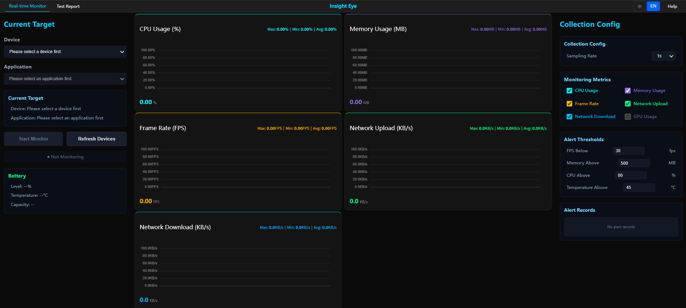
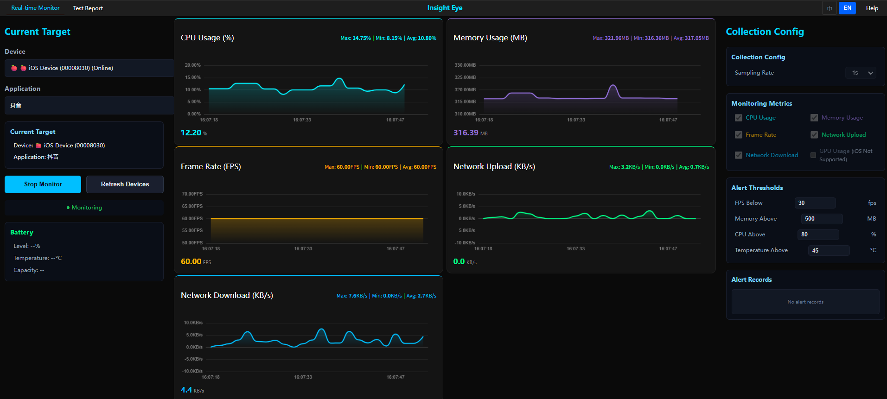
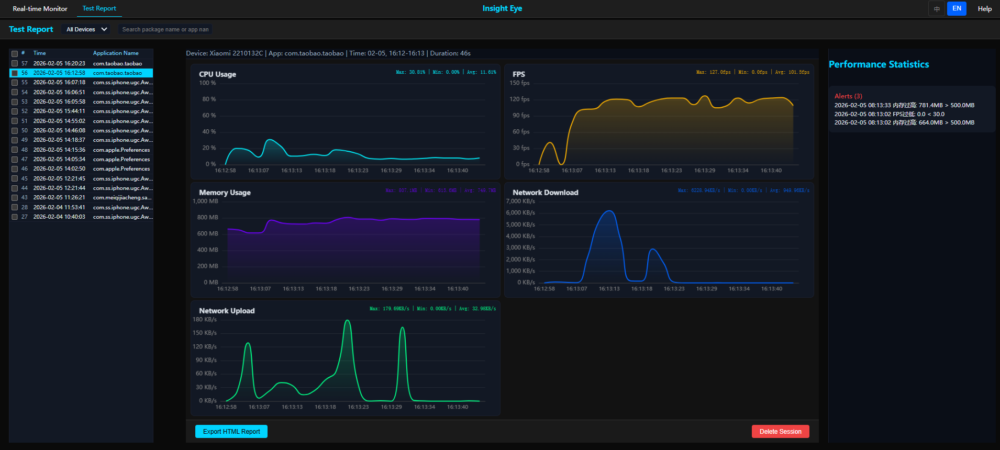

# Insight-Eye Web

<div align="center">

**移动设备性能监控 Web 应用**

[](https://opensource.org/licenses/LICENSE)
[](https://www.python.org/downloads/)
[](https://react.dev/)
[](https://www.typescriptlang.org/)
[](https://github.com/Aceyuan361/Insight_eye/releases)

中文 | **[English](./README.md)**

</div>

---

## 简介

Insight-Eye Web 是一个跨平台的移动设备性能监控 Web 应用，支持 **Android** 和 **iOS** 设备的实时性能数据采集与可视化展示。

### 核心特性

- **多平台支持**: Android (无需 ROOT) 和 iOS (无需越狱)
- **实时监控**: WebSocket 实时推送性能数据
- **可视化展示**: 基于 ECharts 的精美图表展示
- **告警系统**: 自定义告警规则，实时异常检测
- **历史数据**: 会话记录与历史数据查询
- **Web 界面**: 赛博朋克霓虹风格设计

### 支持的监控指标

| 指标类别 | Android | iOS |
|---------|---------|-----|
| CPU | ✅ 应用/系统 | ✅ 应用 |
| 内存 | ✅ PSS/Native/Dalvik | ✅ physFootprint |
| FPS | ✅ 帧率+卡顿检测 | ✅ 系统刷新率 |
| 网络 | ✅ 上行/下行流量 | ✅ 系统流量 |
| 电池 | ✅ 电量/温度 | ✅ 电量/温度 |
| GPU | ✅ 部分设备支持 | ❌ 不支持 |
| 能耗 | ✅ GPU 能耗 | ✅ CPU/GPU/网络能耗 |

---

## 应用截图

### 实时监控面板
实时监控设备性能数据，包括 CPU、内存、FPS、网络等关键指标。



### 测试报告页
查看历史监控会话，分析性能数据和趋势。



### 详细数据展示
深入分析各项性能指标，发现潜在问题。



---

## 快速开始

### 环境要求

- **Python**: 3.10+
- **Node.js**: 18+ (仅开发模式)
- **ADB** (Android 调试桥)
- **pymobiledevice3** >= 7.0.0 (iOS 支持)

### 方式一：从源码运行

```bash
# 1. 克隆仓库
git clone -b 1.0.0 https://github.com/Aceyuan361/Insight_eye.git
cd Insight_eye

# 2. 安装 Python 依赖
pip install -r requirements.txt

# 3. 启动后端服务 (会自动打开浏览器)
python -m insight_eyes

# 后端运行在: http://localhost:8001
# API 文档: http://localhost:8001/docs

# 4. 开发模式：启动前端服务
cd insight_eyes/web-frontend
npm install
npm run dev

# 前端运行在: http://localhost:80 (如果 :80 被占用则是 :81)
```

### 方式二：使用 pip 安装（简化）

```bash
# 1. 安装 Insight-Eye
pip install insight-eyes

# 2. 运行应用 (自动启动后端并打开浏览器)
insight-eye-web

# 后端运行在: http://localhost:8001
# 浏览器会自动打开
```

---

## 项目结构

```
insight-eye-web/
├── insight_eyes/
│   ├── __main__.py           # 程序入口
│   ├── core/                 # 核心层 - 设备管理和数据模型
│   │   ├── device_manager.py # 设备管理器
│   │   ├── base_monitor.py   # 监控基类
│   │   ├── database.py       # SQLite 数据库
│   │   └── models/           # 数据模型
│   ├── public/               # 平台采集器
│   │   ├── adb/              # ADB 封装
│   │   ├── android/          # Android 性能采集
│   │   ├── ios/              # iOS 性能采集
│   │   └── common.py         # 通用工具
│   ├── web/                  # Web 后端 (FastAPI)
│   │   ├── api/
│   │   │   ├── main.py       # FastAPI 主应用
│   │   │   ├── devices.py    # 设备管理 API
│   │   │   ├── monitoring.py # 监控控制 API
│   │   │   └── schemas.py    # Pydantic 数据模型
│   │   └── websocket/        # WebSocket 服务
│   └── web-frontend/         # Web 前端 (React)
│       ├── src/
│       │   ├── components/   # React 组件
│       │   ├── config/       # 配置文件
│       │   ├── i18n/         # 国际化
│       │   ├── services/     # API 服务
│       │   ├── store/        # Zustand 状态管理
│       │   ├── theme/        # 霓虹主题
│       │   ├── types/        # TypeScript 类型
│       │   └── utils/        # 工具函数
│       ├── public/           # 静态资源
│       ├── tests/            # E2E 测试
│       ├── package.json
│       ├── vite.config.ts
│       └── tailwind.config.js
├── docs/                     # 项目文档
├── README.md                 # 英文文档
├── README.zh-CN.md           # 中文文档
├── pyproject.toml            # 包配置
└── requirements.txt          # Python 依赖
```

---

## 使用指南

### 设备连接

**Android 设备**:
1. 启用 USB 调试模式
2. 连接电脑
3. 在 Web 界面中选择设备

**iOS 设备**:
1. 信任电脑并启用开发者模式
2. 连接电脑
3. 在 Web 界面中选择设备

### 创建监控会话

1. 选择要监控的设备
2. 选择应用（Android）或输入 Bundle ID（iOS）
3. 点击"开始监控"
4. 实时查看性能数据

### 配置告警规则

在配置面板可以设置：
- CPU 使用率阈值
- 内存使用量阈值
- FPS 最低阈值
- 电池温度阈值

---

## 技术栈

### 后端

- **FastAPI** - 现代 Web 框架
- **WebSocket** - 实时通信
- **SQLite** - 数据存储
- **ADB** - Android 设备通信
- **pymobiledevice3** - iOS 设备通信

### 前端

- **React 18** - UI 框架
- **TypeScript** - 类型安全
- **Vite** - 构建工具
- **ECharts** - 数据可视化
- **TailwindCSS** - CSS 框架
- **Ant Design** - UI 组件库

---

## API 文档

启动后端服务后，访问 `http://localhost:8001/docs` 查看完整的 API 文档（Swagger UI）。

### 主要 API 端点

| 端点 | 方法 | 描述 |
|------|------|------|
| `/api/devices` | GET | 获取设备列表 |
| `/api/devices/{id}/apps` | GET | 获取应用列表 |
| `/api/monitoring/start` | POST | 开始监控 |
| `/api/monitoring/stop` | POST | 停止监控 |
| `/ws/monitoring/{id}` | WS | 实时数据流 |

---

## 常见问题

### Q: iOS 设备无法连接？

请确保：
1. 设备已信任电脑
2. 已启用开发者模式
3. pymobiledevice3 版本 >= 7.0.0
4. iOS 系统版本在 11.0 - 16.x 之间（不支持 iOS 17+）

### Q: Android 设备检测不到？

请确保：
1. 已安装 ADB
2. USB 调试已启用
3. 已授权电脑调试

### Q: 为什么 iOS 不支持 GPU 监控？

iOS 系统 API 限制，第三方应用无法访问 GPU 使用率数据。

---

## 贡献指南

欢迎提交 Issue 和 Pull Request！

1. Fork 本仓库
2. 创建特性分支 (`git checkout -b feature/AmazingFeature`)
3. 提交更改 (`git commit -m 'Add some AmazingFeature'`)
4. 推送到分支 (`git push origin feature/AmazingFeature`)
5. 开启 Pull Request

---

## 许可证

本项目采用 [MIT License](LICENSE) 开源协议。

---

## 特别鸣谢

本项目的实现离不开以下优秀开源项目给予的思路和支持：

- **[solox](https://github.com/ZCOpen/SoloX)** - 移动性能自动化测试工具，为本项目提供了移动设备性能监控的核心思路
- **[pymobiledevice3](https://github.com/doronz88/pymobiledevice3)** - iOS 设备通信库，让 iOS 监控成为可能
- **[py-ios-device](https://github.com/doronz88/pymobiledevice3)** - iOS 设备管理和通信的底层支持

---

## 相关项目

- **[pymobiledevice3](https://github.com/doronz88/pymobiledevice3)** - iOS 设备通信库
- **[FastAPI](https://github.com/tiangolo/fastapi)** - 现代化 Python Web 框架
- **[ECharts](https://echarts.apache.org/)** - 数据可视化库

---

## 联系方式

- **作者**: Aceyuan361
- **问题反馈**: [GitHub Issues](https://github.com/Aceyuan361/Insight_eye/issues)
- **邮箱**: [594902674@qq.com](mailto:594902674@qq.com)

---

<div align="center">

如果这个项目对你有帮助，请给个 ⭐️ Star！

</div>
