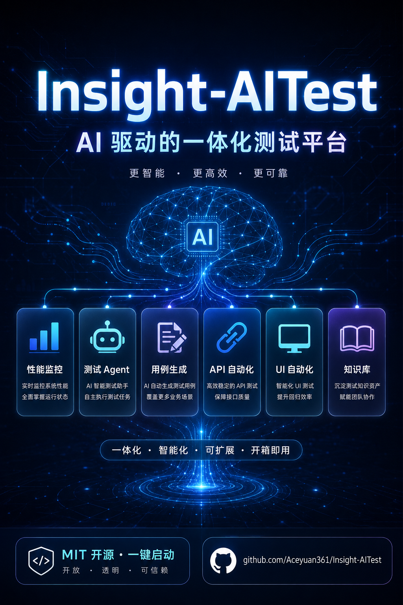
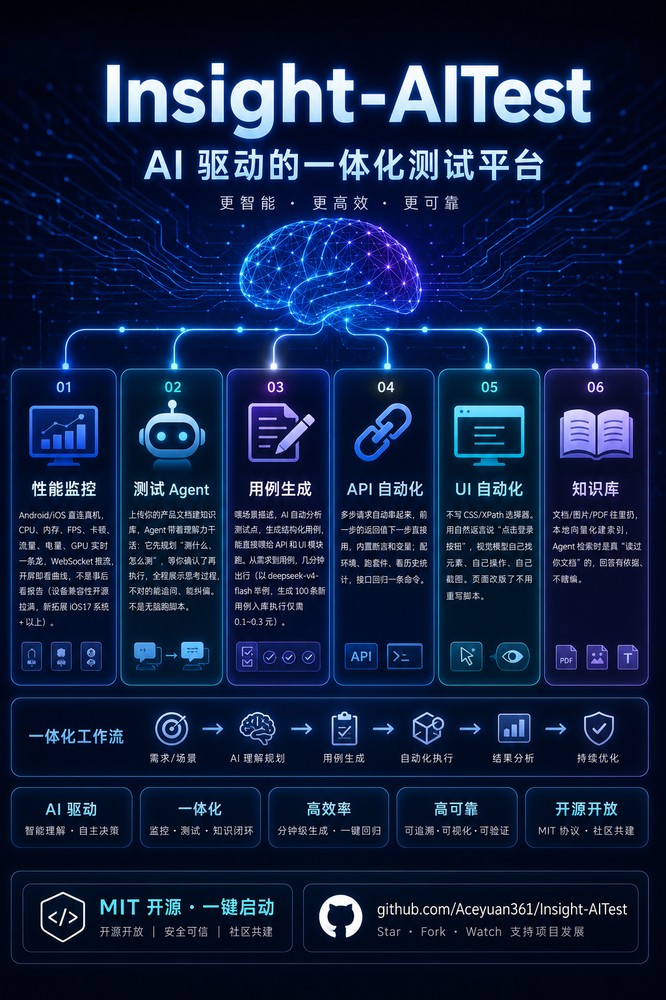
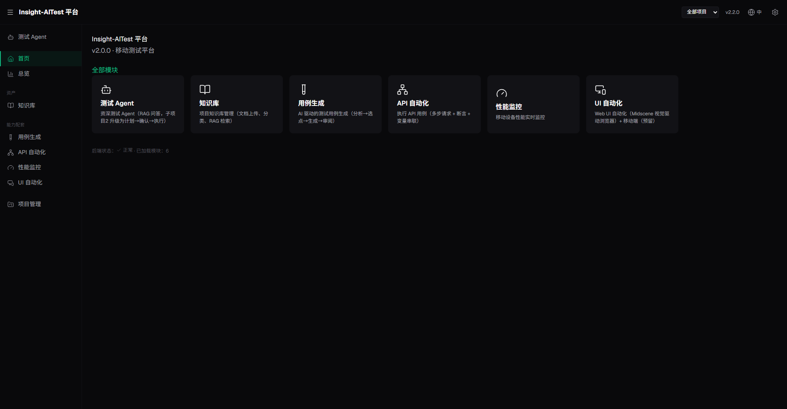
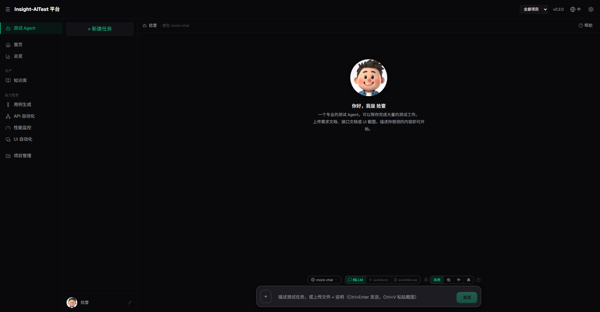
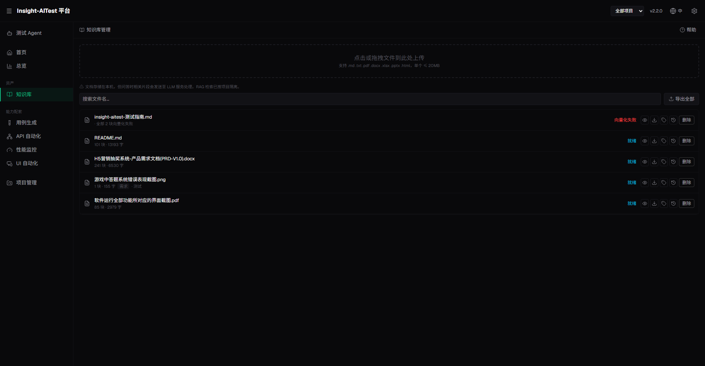
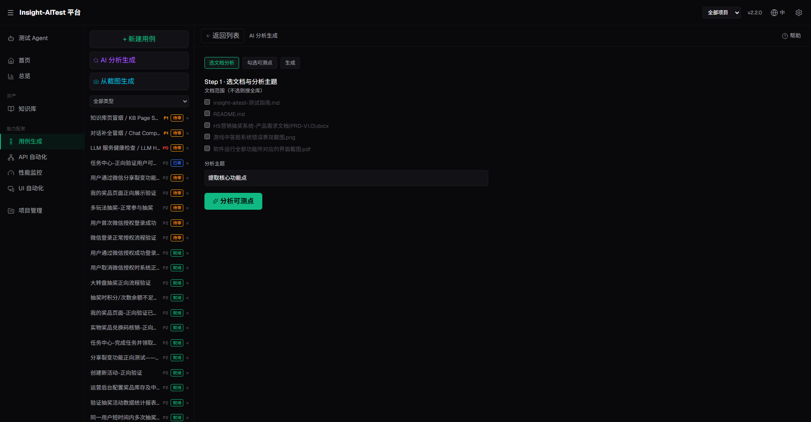
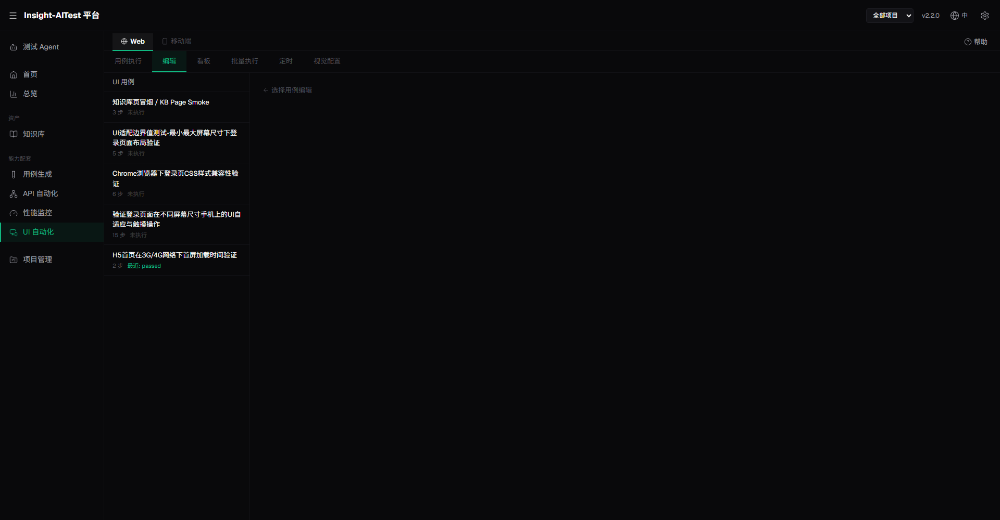
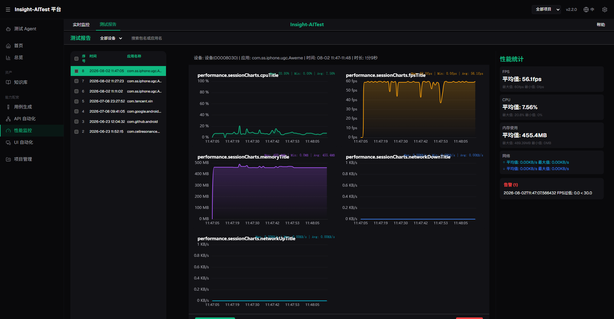

# Insight-AITest

<div align="center">

**模块化 AI 驱动的测试与监控平台**

[](https://opensource.org/licenses/LICENSE)
[](https://www.python.org/downloads/)
[](https://react.dev/)
[](https://www.typescriptlang.org/)
[](https://github.com/Aceyuan361/Insight-AITest/releases)
[](#测试)

中文 | **[English](./README.md)**

</div>

<p align="center">
  
</p>

---

## 简介

Insight-AITest 是一个**模块化 AI 驱动的测试与监控平台**。v2.0.0 从单一性能工具演进为基于插件的平台：每个能力都是一个由 `manifest.yaml` 驱动的模块。平台内核（`platform/`）通过扫描模块、注册路由来装配应用；React 外壳前端（`shell-frontend/`）依据同一份 manifest 渲染各模块 UI。

> **v2.1.0 — iOS 26 全面支持 & 真实 FPS：**
> - iOS 17+/26 设备连接（pymobiledevice3 v10.x userspace tunnel，无需 root/管理员）
> - 自动挂载 Personalized DDI + 无需 Xcode 即可显示「开发者模式」开关
> - 真实应用 FPS（DVT Graphics 服务的 CoreAnimation 帧率）+ Jank 检测
> - CPU 使用率按核心数归一化（PerfDog/Xcode 标准）
> - iOS 26 应用列表分类（应对 ApplicationType 退化）
> - 网络采集优雅降级（iOS 17+/26 的 RSD 不支持 pcapd）

> **v2.0.0 已交付六大核心模块（A–F）加一个知识库模块，全部完成：**
>
> | # | 模块 | 路由 | 用途 |
> |---|------|------|------|
> | A | **平台外壳** | — | 内核 + 模块系统 + 共享前端外壳 |
> | B | **性能监控** | `/performance` | 移动设备（Android/iOS）实时性能监控 |
> | C | **AI 助手** | `/ai` | 基于本地知识库的 RAG 问答 |
> | D | **用例生成** | `/testcase` | AI 驱动的测试用例生成（分析→选点→生成→审阅） |
> | E | **API 自动化** | `/api-runner` | 执行 API 用例（多步请求 + 断言 + 变量串联） |
> | F | **UI 自动化** | `/ui-runner` | Midscene 视觉驱动浏览器自动化 |
> | — | **知识库** | `/kb` | 项目知识库管理（文档上传、向量化，为 C/D 提供 RAG 检索） |

### 核心特性

- **可插拔模块**：每个能力都是自包含模块，加一份 `manifest.yaml` 即可接入。
- **性能监控**：基于 WebSocket 的实时 CPU / 内存 / 网络 / 电池监控（Android 另含 FPS；iOS 见指标表）。
- **AI 助手**：基于自有文档构建本地知识库（本地 embedding + 向量库），RAG 接地问答。
- **用例生成**：AI 分析场景，提出结构化用例供审阅编辑。
- **API 自动化**：多步 HTTP 用例 + 断言 + 跨步 `{{变量}}` 串联，含历史与统计。
- **UI 自动化**：用 **Midscene**（视觉 LLM）驱动真实浏览器 —— `aiAction` / `aiAssert` / `aiQuery`，逐步截图。

### 为什么选择 Insight-AITest？

市面上的测试工具大多只解决**一个**问题。Insight-AITest 是唯一把**性能监控、AI Agent、用例生成、API/UI 自动化**融为一体的开源平台——数据、用例、结果都在一处，不用再在 Postman + JMeter + Selenium + 文档库之间来回切换。

| 能力 | Insight-AITest | Postman | MeterSphere | Katalon | Selenium/Playwright |
|---|:---:|:---:|:---:|:---:|:---:|
| 🤖 AI Agent（懂文档、会规划、能执行） | ✅ | ❌ | ❌ | ⚠️ 有限 | ❌ |
| 📊 移动端性能监控（Android/iOS） | ✅ | ❌ | ❌ | ❌ | ❌ |
| 📝 AI 用例生成 | ✅ | ❌ | ❌ | ⚠️ 有限 | ❌ |
| 🔗 API 自动化（多步+断言+套件） | ✅ | ✅ | ✅ | ✅ | ❌ |
| 🖥️ 视觉驱动 UI 自动化（无需选择器） | ✅ | ❌ | ❌ | ❌ | ⚠️ 纯代码 |
| 📚 本地 RAG 知识库（你的文档） | ✅ | ❌ | ❌ | ❌ | ❌ |
| 🔒 数据全在本地（无云端绑定） | ✅ | ❌ | ⚠️ | ❌ | ✅ |
| 🧩 插件式模块架构 | ✅ | — | ⚠️ | ❌ | — |
| 💰 成本 | 🟢 免费/MIT | 🟡 部分免费 | 🟢 免费 | 🔴 付费 | 🟢 免费 |

### 💎 核心优势

| 传统方式 | Insight-AITest | 意义 |
|---|---|---|
| 手写 API/UI 脚本 | 自然语言描述要测什么，Agent 自主规划执行 | 小时级→分钟级；页面/接口改版不用重写脚本 |
| 性能监控靠独立工具、事后看报告 | 点开即 WebSocket 实时推流 | 第一时间发现性能回归，不是跑完才看 |
| 知识散落在 wiki/文档里 | 文档上传→本地向量化→Agent 基于你的产品回答 | AI 真"读过"你的文档，回答有依据、可溯源 |
| 手动挑 CSS/XPath 选择器 | 视觉模型看截图+描述就能定位元素 | 页面重渲染不再让脚本失效 |
| 在 4-5 个工具间来回切换 | 一个平台、一套数据模型、可插拔扩展 | 用例流转：生成→跑 API→跑 UI，全在一处 |

### 支持的性能指标

| 指标类别 | Android | iOS |
|---------|---------|-----|
| CPU | ✅ 应用/系统 | ✅ 应用（DVT Sysmontap） |
| 内存 | ✅ PSS/Native/Dalvik | ✅ physFootprint（DVT Sysmontap） |
| FPS | ✅ 帧率+卡顿检测 | ❌ 不支持（iOS 平台限制，CoreAnimation 私有 API） |
| 网络 | ✅ 上行/下行流量 | ✅ 系统流量（PcapdService） |
| 电池 | ✅ 电量/温度 | ✅ 电量（DiagnosticsService） |
| GPU | ✅ 部分设备支持 | ❌ 不支持 |
| 能耗 | ✅ GPU 能耗 | ✅ CPU/GPU/网络能耗 |

### iOS 版本兼容性

| iOS 版本 | 连接方式 | 要求 |
|---------|---------|------|
| 11.0 - 16.x | usbmux 直连 | 信任电脑 + DeveloperDiskImage 挂载 |
| 17.0+ / 26.x | CoreDevice Tunnel | 信任电脑 + Developer Mode + pymobiledevice3 >= 10.3.0 |

iOS 17+ 设备通过 pymobiledevice3 v10.x 的 `UserspaceRsdTunnel`（CoreDevice tunnel，纯 Python 网络栈）自动建立连接，跨平台、无需 root/管理员，无需手动启动 tunneld。

### 界面预览

<p align="center">
  
</p>

<p align="center">
  <br>
  <sub>首页 / 总览</sub>
</p>

<table>
  <tr>
    <td width="50%" align="center"><br><sub>测试 Agent（C）</sub></td>
    <td width="50%" align="center"><br><sub>知识库</sub></td>
  </tr>
  <tr>
    <td width="50%" align="center"><br><sub>用例生成（D）</sub></td>
    <td width="50%" align="center"><br><sub>API 自动化（E）</sub></td>
  </tr>
  <tr>
    <td width="50%" align="center"><br><sub>UI 自动化（F）</sub></td>
    <td width="50%" align="center"><br><sub>性能监控（B）</sub></td>
  </tr>
</table>

---

## 快速开始

### 环境要求

- **Python**: 3.10+
- **Node.js**: 16+ 和 npm ⚠️ **必需** - 从 [nodejs.org](https://nodejs.org/) 安装
- **ADB**（Android 调试桥）- 用于 Android 设备
- **pymobiledevice3** >= 10.3.0 - 用于 iOS 设备（iOS 17+/26 需 v10.2+ 的 CoreDevice tunnel 支持）
- **Playwright Chromium** - UI 自动化（F）所需：`playwright install chromium`

### 一键启动（Windows）✨

Windows 用户克隆仓库后，**直接双击 `start.bat`** 即可。脚本会自动检测 Python / Node 环境、首次运行自动安装 Python 依赖，随后启动平台（后端 + 前端 + 自动打开浏览器）。后续运行会跳过安装步骤，快速重启。

### 手动安装

```bash
# 1. 克隆仓库
git clone https://github.com/Aceyuan361/Insight-AITest.git
cd Insight-AITest

# 2. 安装 Python 依赖
pip install -r requirements.txt

# 3.（仅 UI 自动化）安装浏览器驱动
playwright install chromium

# 4. 启动平台（自动启动后端 + 前端开发服务器并打开浏览器）
python -m insight_aitest

# 服务将自动启动：
# - 后端 API：http://localhost:8001
# - 前端界面：http://localhost:80
# - API 文档：http://localhost:8001/docs
```

> **说明**：`python -m insight_aitest` 会启动 FastAPI 后端（8001）、React 前端开发服务器（80）并打开浏览器；若 `node_modules` 不存在会先执行 `npm install`。

### LLM 配置（模块 C / D / F）

AI 模块从环境变量读取 LLM 凭证。C/D 至少需要对话模型；UI 自动化（F）额外支持专用视觉模型：

```bash
# 对话 / 推理（模块 C、D）
export INSIGHT_EYE_AI_LLM_BASE_URL=https://api.example.com/v1
export INSIGHT_EYE_AI_LLM_API_KEY=sk-...
export INSIGHT_EYE_AI_CHAT_MODEL=gpt-4o-mini

# 视觉（模块 F）—— 可选，未设置时回退到对话模型
export INSIGHT_EYE_AI_VISION_MODEL=gpt-4o
```

完整变量列表（embedding、检索调参、超时等）见 [`docs/`](./docs/)。

### 网络访问

应用默认绑定所有网络接口（`0.0.0.0`），支持局域网内其他设备访问。

1. 查看本机 IP 地址（Windows 用 `ipconfig`，Linux/Mac 用 `ifconfig` 或 `ip addr`）。
2. 通过 `http://<你的IP>:80`（前端）或 `http://<你的IP>:8001`（后端 / API 文档）访问。

---

## 项目结构

```
Insight-AITest/
├── insight_aitest/
│   ├── __main__.py               # 入口点：python -m insight_aitest
│   ├── platform/                 # 平台内核 + 共享服务（A）
│   │   ├── kernel.py             # FastAPI 装配（扫描模块 → 注册路由）
│   │   ├── module_registry.py    # manifest 扫描 / 校验 / 拓扑排序
│   │   ├── persistence/          # DatabaseManager（共享数据库层）
│   │   ├── services/             # 设备管理、采集器（adb/android/ios）、llm/
│   │   └── api/platform.py       # /api/platform/*（模块列表、健康检查）
│   ├── modules/                  # 可插拔模块（每个含 manifest.yaml）
│   │   ├── _registry/            # 模块契约（manifest schema、基类）
│   │   ├── performance/          #（B）实时性能监控
│   │   ├── ai/                   #（C）RAG 知识库助手
│   │   ├── testcase/             #（D）AI 用例生成
│   │   ├── api/                  #（E）API 自动化
│   │   ├── ui/                   #（F）UI 自动化（Midscene + Playwright）
│   │   └── example/              # 占位模块（验证模块机制）
│   └── shell-frontend/           # React 平台外壳
│       └── src/
│           ├── shell/            # AppShell、TopBar、SideNav、Dashboard、主题
│           ├── modules/          # 各模块前端（performance/ai/testcase/api/ui/）
│           ├── shared/           # api client、types、config、i18n
│           ├── module-map.ts     # 静态模块入口 → 组件映射
│           └── routing.tsx       # 由 manifest 驱动的 react-router 装配
├── tests/                        # pytest 套件（719 passed, 1 skipped）
├── docs/                         # 文档 + spec + 交接笔记
├── README.md / README.zh-CN.md
├── ROADMAP.md                    # A–F 子系统路线图与状态
├── pyproject.toml                # 包配置（v2.1.0）
└── requirements.txt              # Python 依赖
```

---

## 模块指南

### B — 性能监控（`/performance`）

基于 WebSocket 的实时设备指标。连接 Android（USB 调试）或 iOS（信任 + 开发者模式）设备，选择应用（Android）或输入 Bundle ID（iOS）开始监控。在配置面板设置告警阈值（CPU / 内存 / FPS / 电池温度）。

### C — AI 助手（`/ai`）

上传文档构建本地知识库（embedding 本地存储），随后基于自有内容进行接地问答（RAG）。

### D — 用例生成（`/testcase`）

AI 分析场景、选取测试点并生成结构化用例，供你审阅编辑后再交给 E 或 F 使用。

### E — API 自动化（`/api-runner`）

编排多步 HTTP 用例，支持断言与跨步 `{{变量}}` 串联。可针对不同环境（可配置 `base_url`）执行，查看历史、统计与每步请求/响应。

### F — UI 自动化（`/ui-runner`）

以步骤形式编写用例，执行器归一化每一步并用 **Midscene** 视觉方法驱动真实浏览器：

- `action` → `aiAction`（执行）
- `assert` → `aiAssert`（校验）
- `extract` → `aiQuery`（读取数据，通过 `{{var}}` 串联）

每一步记录截图（存文件系统，不入库）与操作日志；某步 `error` 不中断后续步骤（与 E 一致）。每次执行可覆盖 `base_url`。

> **说明**：UI 自动化的单测可离线运行（执行器接受可注入的 `agent_factory`）。**真实端到端**浏览器执行需设置 `INSIGHT_EYE_AI_VISION_MODEL`（或 `CHAT_MODEL`）+ 有效 API key，并执行 `playwright install chromium`。

---

## 技术栈

### 后端

- **FastAPI** + **uvicorn** — Web 框架 / ASGI 服务器
- **WebSocket** — 实时性能数据推送
- **SQLAlchemy** + **SQLite** — 各模块独立数据库（WAL 模式）
- **ADB** — Android 设备通信
- **pymobiledevice3** — iOS 设备通信
- **Playwright** + **PyMidscene** — 视觉驱动浏览器自动化（F）
- **jsonpath-ng** — API 响应断言（E）

### 前端

- **React 19** + **TypeScript** + **Vite**
- **react-router-dom** — 由模块 manifest 驱动的路由
- **Zustand** — 各模块状态 store
- **ECharts** — 数据可视化
- **TailwindCSS** — 样式（暗色赛博朋克霓虹主题）
- **i18next** — 国际化（zh / en）

---

## API 文档

启动后端后访问 `http://localhost:8001/docs` 查看完整 Swagger UI。端点概览：

### 平台

| 端点 | 方法 | 描述 |
|------|------|------|
| `/api/platform/modules` | GET | 已挂载模块列表（id、order、route） |
| `/api/platform/health` | GET | 健康检查 |

### 模块端点

| 模块 | 基础路径 | 主要能力 |
|------|----------|----------|
| 性能监控（B） | `/api/devices`、`/api/monitoring/*`、`/ws/monitoring/{id}` | 设备、应用、开始/停止、实时 WS 流 |
| AI 助手（C） | `/api/modules/ai/...` | 知识库上传、对话 |
| 用例生成（D） | `/api/modules/testcase/...` | 生成、列表、编辑（PUT） |
| API 自动化（E） | `/api/modules/api/runs/...` | 执行、历史、详情、统计、套件、环境 |
| UI 自动化（F） | `/api/modules/ui/runs/...` | 执行、历史、详情、截图、统计、删除 |

---

## 测试

```bash
# 全量 Python 套件
python -m pytest tests/ -q        # → 719 passed, 1 skipped

# 按子系统
python -m pytest tests/ui/ -q     # UI 自动化（F）：30 个测试
python -m pytest tests/api/ -q    # API 自动化（E）
# ... performance / ai / testcase / platform

# 前端类型检查 + 构建
cd insight_aitest/shell-frontend
npm run build                     # tsc -b && vite build

# 前端 E2E（Playwright）
npm run test:e2e
```

> 每个模块的执行器都用可注入的 Fake 做单测（不依赖真实浏览器 / LLM / 设备），整套件可完全离线运行。

---

## 常见问题

### Q：iOS 设备无法连接？
请确保设备已信任电脑、已启用开发者模式（iOS 16+）、`pymobiledevice3 >= 10.3.0`。iOS 11–16 走 usbmux 直连，iOS 17+/26 通过 CoreDevice tunnel 连接。若 iOS 26 报「未找到 iOS 17+ tunnel 服务」，请将 pymobiledevice3 升级到 ≥10.3.0——旧版 9.x 无法与 iOS 26 改动后的 CoreDevice 协议握手。

### Q：Android 设备检测不到？
请确保已安装 ADB、已启用 USB 调试、已授权电脑调试。

### Q：UI 自动化没反应 / 报错？
UI 自动化（F）需要视觉能力的 LLM。请设置 `INSIGHT_EYE_AI_VISION_MODEL`（或回退到 `INSIGHT_EYE_AI_CHAT_MODEL`）+ 有效 `INSIGHT_EYE_AI_LLM_API_KEY`，并执行一次 `playwright install chromium`。单测已离线覆盖执行器逻辑；真实浏览器执行需要上述配置。

### Q：为什么 iOS 不支持 GPU 监控？
iOS 系统 API 限制，第三方应用无法访问 GPU 使用率数据。

---

## 贡献指南

欢迎提交 Issue 和 Pull Request！

1. Fork 本仓库
2. 创建特性分支（`git checkout -b feature/AmazingFeature`）
3. 提交更改（`git commit -m 'Add some AmazingFeature'`）
4. 推送到分支（`git push origin feature/AmazingFeature`）
5. 开启 Pull Request

---

## 许可证

本项目采用 [MIT License](LICENSE) 开源协议。

---

## 特别鸣谢

本项目的实现离不开以下优秀开源项目给予的思路和支持：

- **[solox](https://github.com/ZCOpen/SoloX)** - 移动性能自动化测试工具，为本项目提供了移动设备性能监控的核心思路
- **[pymobiledevice3](https://github.com/doronz88/pymobiledevice3)** - iOS 设备通信库，让 iOS 监控成为可能
- **[py-ios-device](https://github.com/YueChen-C/py-ios-device)** - iOS 设备管理和通信的底层支持
- **[Midscene.js](https://midscenejs.com/)** - 视觉驱动 UI 自动化，驱动 UI 自动化模块

---

## 联系方式

- **作者**: Aceyuan361
- **问题反馈**: [GitHub Issues](https://github.com/Aceyuan361/Insight-AITest/issues)
- **交流讨论**: [GitHub Discussions](https://github.com/Aceyuan361/Insight-AITest/discussions)

---

<div align="center">

如果这个项目对你有帮助，请给个 ⭐️ Star！

</div>
